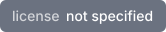

# Vivary website

[](#license)
[](https://github.com/vivary-dev/vivary-site/actions/workflows/ci.yml)

The marketing site for the new Vivary, the desktop application where agents
work from files you own. It markets the app and presents the library that
ships today as the engine underneath. Started from scratch on 2026-09-13 to
replace the Astro site at vivary.vercel.app. It goes live with the app.

## Stack

Next.js 16 (App Router, TypeScript), Tailwind CSS 4, shadcn/ui 4 on Base UI,
pnpm 10, Node 24. Imagery through Dither Kit, icons through icons0, UI audits
through shadscan, analytics through Umami.

## Run it

```bash
node scripts/publish-scan.mjs .
pnpm install --frozen-lockfile
pnpm dev
```

Then open the printed local URL. `pnpm build` produces the production build
and `pnpm lint` runs ESLint.

## Layout

- `src/app/` holds routes and the root layout.
- `src/components/ui/` holds shadcn components. Add more with the pinned CLI
  named in `AGENTS.md`.
- `public/` holds static assets and imagery.
- `scripts/` holds the branch helper, the supply-chain scan, the dev-server
  starter, and the headless screenshot script. See AGENTS.md, "Seeing your work".

## Rules

`AGENTS.md` is the law for anyone or anything editing this repo: truth rules
for product claims, the design bar, the tool table, dependency gates, and the
branch model. `DEVLOG.md` records every session.

## Status

One page, the home route, locked in on 2026-09-13. Static export to `out/`
for Cloudflare. Not published yet.

## Cloudflare configuration

`wrangler.toml` points Cloudflare Pages at the static export in `out/`.
When Jeff creates the Pages project, use these build settings:

| Setting | Value |
| --- | --- |
| Framework preset | Next.js (Static HTML Export) |
| Production branch | `main` |
| Build command | `pnpm build` |
| Build output directory | `out` |
| Node version | `24.15.0`, also recorded in `.node-version` |
| pnpm version | `10.33.2`, recorded in `package.json` |

Cloudflare's [static Next.js guide](https://developers.cloudflare.com/pages/framework-guides/nextjs/deploy-a-static-nextjs-site/)
and [Pages configuration reference](https://developers.cloudflare.com/pages/functions/wrangler-configuration/)
are the source for these settings. Pages manages the build command in its build
settings. It is not a Wrangler Pages configuration key.
Creating the project, connecting the repository, choosing preview branches, and
DNS setup remain Jeff's actions. Nothing in this repository deploys from CI.

## Optional analytics

Umami's instance is undecided. To enable its tracker, set both variables before
building the static export:

| Variable | Value |
| --- | --- |
| `NEXT_PUBLIC_UMAMI_WEBSITE_ID` | The website ID from the chosen Umami instance |
| `NEXT_PUBLIC_UMAMI_SCRIPT_URL` | The full URL of that instance's tracker script |

Both values are public build-time configuration, not secrets. Rebuild to change
them. The client component renders no tracker in development or when either
value is missing. With both set in production, Next.js loads one script after
the page becomes interactive. No instance or website is created by this code.
See [Umami's tracker configuration](https://docs.umami.is/docs/tracker-configuration).

## Checks

Pull requests run the publication scan before frozen installation or any
dependency-backed command. They then run lint, TypeScript, the static build,
and the pinned shadscan CLI. The workflow retains its JSON report as an artifact.
Dither Kit's CLI never runs in CI.

```bash
node scripts/publish-scan.mjs .
pnpm install --frozen-lockfile
pnpm lint
pnpm exec tsc --noEmit
pnpm build
pnpm dlx @shadscan/cli@0.17.0 . --format json --no-interactive --no-roast
```

## License

This repository has no repository-wide license grant. Its license badge records
that absence. The vendored Lucide icons retain their [upstream license](src/components/icons/lucide/LICENSE).
The two README badges are checked-in SVGs from shieldcn's
[static badge endpoint](https://shieldcn.dev/docs/badges/static). The CI badge
links to workflow results and does not report a live build status.
