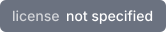

# Vivary website

[](#license)
[](https://github.com/vivary-dev/vivary-site/actions/workflows/ci.yml)

The marketing site for the new Vivary, the desktop application where agents
work from files you own. It markets the app and presents the library that
ships today as the engine underneath. Started from scratch on 2026-09-13 to
replace the Astro site at vivary.vercel.app. The public site is https://vivary-dev.github.io/.

## Stack

Next.js 16 (App Router, TypeScript), Tailwind CSS 4, shadcn/ui 4 on Base UI,
pnpm 10, Node 24. Imagery through Dither Kit, icons through icons0, UI audits
through shadscan, and optional Umami analytics gated by production configuration.

## Run it

```bash
node scripts/publish-scan.mjs .
pnpm install --frozen-lockfile
pnpm dev
```

Then open the printed local URL. `pnpm build` produces the production build
and `pnpm lint` runs ESLint.

## Layout

- `src/app/` holds routes and the root layout.
- `src/components/ui/` holds shadcn components. Add more with the pinned CLI
  named in `AGENTS.md`.
- `public/` holds static assets and imagery.
- `scripts/` holds the branch helper, the supply-chain scan, the dev-server
  starter, and the headless screenshot script. See AGENTS.md, "Seeing your work".

## Rules

`AGENTS.md` is the law for anyone or anything editing this repo: truth rules
for product claims, the design bar, the tool table, dependency gates, and the
branch model. `DEVLOG.md` records every session.

## Status

The home page is built to Jeff's design canvas of 2026-09-16 as one
responsive page, with the brand system's jar mark, lockup, hero illustration,
social image, and app icon. Two documentation pages, `/what-is-vivary/` and
`/commands/`, a styled 404, `robots.txt`, `sitemap.xml`, Open Graph
metadata, and JSON-LD. Static export to `out/`, published on GitHub Pages.

## Brand and design sources

| Path | What it is |
| --- | --- |
| `docs/brand/system/` | The brand system: `tokens.json`, `README.md`, `MARK-DIRECTIONS.md`, fonts, and every asset (marks, wordmark, lockups, app icon, hero, social, org hero, brand sheet), plus approved mascot rules and a versioned checksum manifest. |
| `docs/design/2026-09-16-home/` | The home page design canvas, desktop and phone, as static HTML. The reference the home route is built to. |
| `public/brand/` | The assets the site serves: the jar mark, four family marks, the horizontal lockup, the hero in WebP and PNG, the social image. |
| `docs/brand/` | The working set: product description, repo map, asset notes, URL map, the humans-and-agents rules. |

## Routes

| Route | What it is |
| --- | --- |
| `/` | The home page, built to the 2026-09-16 canvas. Tune it, do not redesign it. |
| `/what-is-vivary/` | The product description as a page, with the six steps, the promises, and the questions people ask. |
| `/commands/` | The workspace commands, the five files, the four layers, the pinned install command, and the published packages. |
| `/llms.txt` | Agent-specific guidance. Every documentation page links to it near the top. |
| `/robots.txt`, `/sitemap.xml` | Generated at build. |

Shared chrome lives in `src/app/shell.tsx`. Page styles beyond the home page
are in `src/app/pages.css`. Product claims still come only from
`src/content/facts.ts`.

## The product repository

The app this site markets is built in `vivary-dev/vivary`. Product claims in
`src/content/facts.ts` cite its documents and the dated public Windows preview
release. The September 22 download and newer development source have separate
status; the preview does not establish complete desktop acceptance. The public
site links the release, installation guide, current source and company skills.

## Public site and publishing

The canonical website is https://vivary-dev.github.io/, selected by Jeff on
2026-10-03. GitHub Pages serves the built export from `main:/` in
`vivary-dev/vivary-dev.github.io`. That repository contains generated output.
This repository owns source. Source CI verifies changes and does not deploy.

After a source change is reviewed, merged into `dev` and approved to publish:

```bash
scripts/deploy-site.sh
```

The script builds with `NEXT_PUBLIC_SITE_URL=https://vivary-dev.github.io` and
`NEXT_PUBLIC_PREVIEW=0`, checks public indexing and canonical metadata, then
commits the export on top of the existing Pages history. A normal push rejects
concurrent changes. Existing unrelated files and old hashed assets are preserved.
Check the Pages run and live HTML, robots, sitemap and changed assets afterward.
A source merge alone is not a deployment. Do not promote source `main` merely
to publish this reviewed export.

The former `deploy-preview.sh` stops with a pointer to the public publisher,
so an old command cannot restore noindex on the canonical site. An unpublished
local preview can still use `NEXT_PUBLIC_PREVIEW=1`. Set
`NEXT_PUBLIC_SITE_URL` explicitly when testing an alternative local origin.
The normal build defaults to the chosen public address. Its robots wildcard
allows search and declares `Content-Signal: search=yes, ai-train=no`. AI input
permission remains unspecified and the four specific training-crawler blocks
remain in place. See `docs/brand/09-humans-and-agents.md` for the policy.

`wrangler.toml` records the previous Cloudflare proposal. It does not deploy
anything and is not the current publishing route. No custom domain or DNS
change is part of this setup.

## Optional analytics

Umami's instance is undecided. To enable its tracker, set both variables before
building the static export:

| Variable | Value |
| --- | --- |
| `NEXT_PUBLIC_UMAMI_WEBSITE_ID` | The website ID from the chosen Umami instance |
| `NEXT_PUBLIC_UMAMI_SCRIPT_URL` | The full URL of that instance's tracker script |

Both values are public build-time configuration, not secrets. Rebuild to change
them. The client component renders no tracker in development or when either
value is missing. With both set in production, Next.js loads one script after
the page becomes interactive. No instance or website is created by this code.
See [Umami's tracker configuration](https://docs.umami.is/docs/tracker-configuration).

## Checks

Pull requests run the publication scan before frozen installation or any
dependency-backed command. They then run lint, TypeScript, the static build,
and the pinned shadscan CLI. The workflow retains its JSON report as an artifact.
Dither Kit's CLI never runs in CI.

```bash
node scripts/publish-scan.mjs .
pnpm install --frozen-lockfile
pnpm lint
pnpm exec tsc --noEmit
pnpm build
node scripts/verify-public-export.mjs
pnpm dlx @shadscan/cli@0.17.0 . --format json --no-interactive --no-roast
```

## License

This repository has no repository-wide license grant. Its license badge records
that absence. The vendored Lucide icons retain their [upstream license](src/components/icons/lucide/LICENSE).
The two README badges are checked-in SVGs from shieldcn's
[static badge endpoint](https://shieldcn.dev/docs/badges/static). The CI badge
links to workflow results and does not report a live build status.
